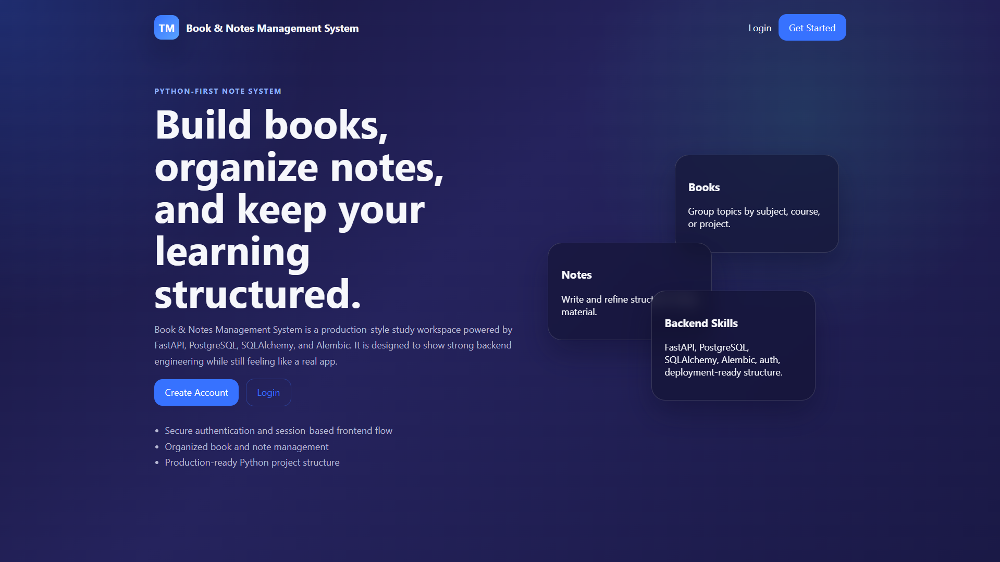
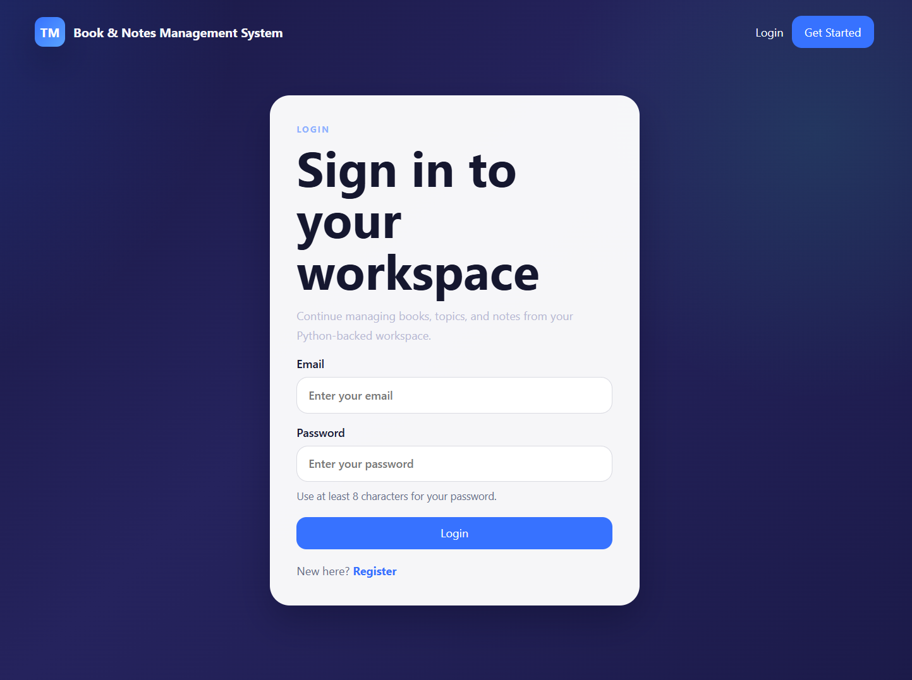
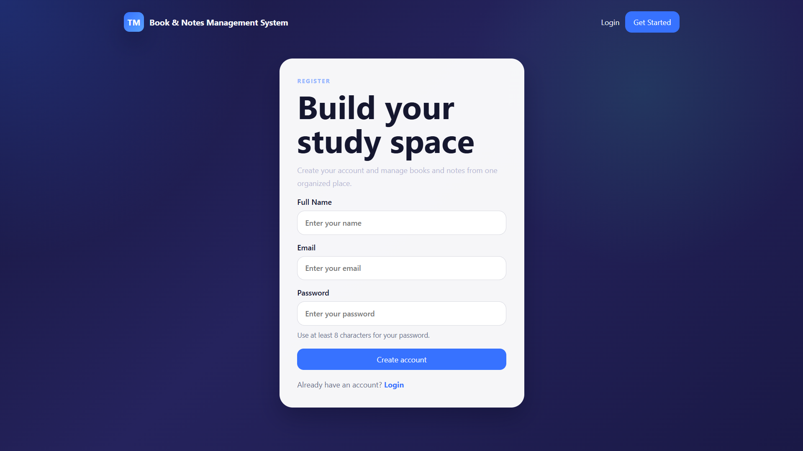
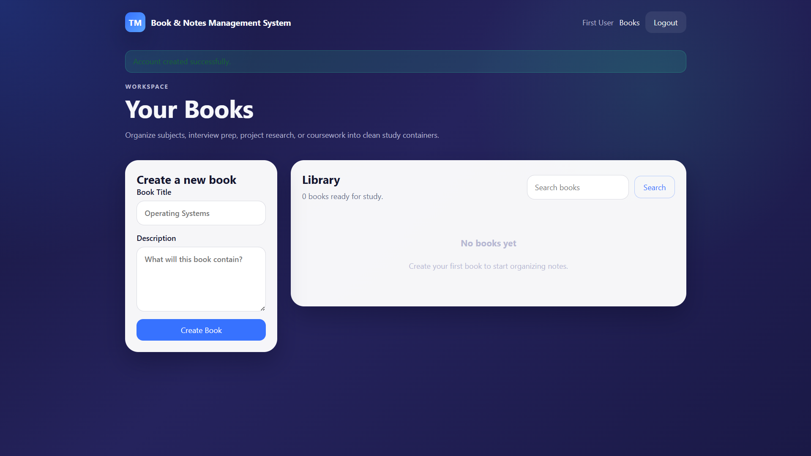

# Book & Notes Management System

A production-style study workspace built with FastAPI, PostgreSQL, SQLAlchemy, Alembic, and server-rendered Jinja templates.

This project lets users register, log in, create books, organize notes, and manage structured study content through both a browser UI and a REST API. It was built to demonstrate practical backend engineering skills: authentication, validation, migrations, database design, debugging, testing, and cloud deployment.

## Live Demo

- App: `https://book-notes-management-system-production.up.railway.app/`
- API Docs: `https://book-notes-management-system-production.up.railway.app/docs`
- Health Check: `https://book-notes-management-system-production.up.railway.app/api/v1/health`

## Screenshots

### Landing Page


### Login Page


### Register Page


### Books Dashboard


## What This Project Includes

- User registration, login, logout, and refresh-token flow
- Session-backed web frontend plus REST API
- Protected CRUD operations for books, notes, and comments
- Search, sorting, filtering, and pagination support
- Request validation and centralized error handling
- Request logging and rate limiting
- Alembic migrations for schema management
- Railway-ready deployment configuration
- Docker support for local containerized setup

## Tech Stack

- Python 3.12
- FastAPI
- SQLAlchemy 2
- PostgreSQL
- Alembic
- Pydantic
- Jinja2
- PyJWT
- bcrypt
- HTML/CSS
- Pytest

## Project Highlights

- Clean layered backend structure using routes, controllers, services, schemas, models, and middleware
- API and web form flows share the same business logic and validation rules
- Production deployment issues were debugged and fixed, including static asset loading, startup migrations, and web form error handling
- Automated tests cover auth, health checks, resources, and core web flows

## Project Structure

```text
backend/
  app/
    api/
    controllers/
    core/
    db/
    middleware/
    models/
    schemas/
    services/
    static/
    templates/
    utils/
  alembic/
  requirements.txt
  Dockerfile
  start.sh
  pytest.ini
  tests/
docker-compose.yml
render.yaml
README.md
```

## Run Locally

```bash
cd backend
python -m venv .venv
.venv\Scripts\activate
pip install -r requirements.txt
alembic upgrade head
uvicorn app.main:app --reload
```

Open:

- Frontend: `http://localhost:8000/`
- API Docs: `http://localhost:8000/docs`
- Health Check: `http://localhost:8000/api/v1/health`

## Environment Variables

Required:

- `DATABASE_URL`
- `JWT_ACCESS_SECRET`
- `JWT_REFRESH_SECRET`
- `SESSION_SECRET`

Common production values:

```env
APP_NAME=Book & Notes Management System
ENVIRONMENT=production
API_V1_PREFIX=/api/v1
HOST=0.0.0.0
JWT_ACCESS_EXP_MINUTES=15
JWT_REFRESH_EXP_DAYS=7
JWT_ALGORITHM=HS256
REFRESH_COOKIE_NAME=book_notes_refresh_token
BCRYPT_ROUNDS=12
CORS_ORIGINS=["https://book-notes-management-system-production.up.railway.app"]
RATE_LIMIT_WINDOW_SECONDS=900
RATE_LIMIT_MAX_REQUESTS=200
AUTH_RATE_LIMIT_MAX_REQUESTS=20
RUN_MIGRATIONS_ON_STARTUP=1
```

## Database Migrations

Apply migrations:

```bash
cd backend
alembic upgrade head
```

Create a new migration:

```bash
cd backend
alembic revision --autogenerate -m "describe change"
```

## Testing

Run the backend test suite:

```bash
cd backend
python -m pytest
```

Current automated coverage includes:

- authentication flows
- health and meta endpoints
- books, notes, and comments API behavior
- server-rendered web flow
- static asset delivery

## Docker

Run with Docker Compose:

```bash
docker compose up --build
```

## Deployment Notes

### Railway

Recommended Railway setup:

- Root directory: `backend`
- Builder: `Dockerfile`
- Dockerfile path: `Dockerfile`
- Health check path: `/api/v1/health`
- Custom build command: leave empty
- Custom start command: leave empty

This works because the Dockerfile already runs `start.sh`, and `start.sh` runs migrations before starting Uvicorn.

### Render

The repository also includes [`render.yaml`](render.yaml) for Render deployment.

## Key API Endpoints

- `POST /api/v1/auth/register`
- `POST /api/v1/auth/login`
- `POST /api/v1/auth/refresh`
- `POST /api/v1/auth/logout`
- `GET /api/v1/auth/me`
- `GET|POST /api/v1/books`
- `GET|PATCH|DELETE /api/v1/books/{book_id}`
- `GET|POST /api/v1/books/{book_id}/notes`
- `GET|PATCH|DELETE /api/v1/books/{book_id}/notes/{note_id}`
- `GET|POST /api/v1/notes/{note_id}/comments`
- `GET|PATCH|DELETE /api/v1/notes/{note_id}/comments/{comment_id}`

## What This Project Demonstrates

- designing a structured FastAPI backend
- building and validating auth flows
- working with PostgreSQL and Alembic migrations
- debugging real deployment problems in production
- serving a complete web app with Jinja templates
- writing tests for API and frontend behavior

## Next Nice Upgrade

The next upgrade I would recommend is adding a book detail / notes screenshot as well, so the README shows not only authentication and dashboard views, but also deeper in-app note management.
